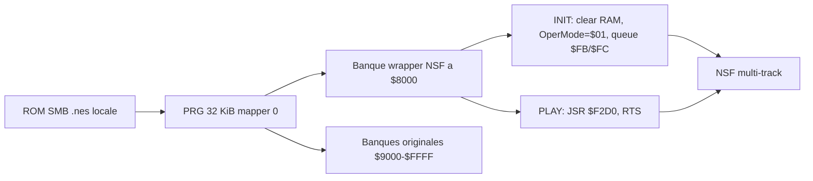

# Audio NES, NSF et MP3

Ce document decrit comment qlnes comprend et exporte la musique NES, avec une
attention particuliere au moteur audio custom de Super Mario Bros.

## Objectif

Le but n'est pas de "renommer" une ROM `.nes` en `.nsf`. Une ROM NES contient
du code 6502, des donnees audio, du gameplay, parfois du bankswitching, et un
moteur sonore propre au jeu. Un fichier NSF doit au contraire exposer une
interface lisible par un player :

- `INIT(A=song-1)` initialise une piste.
- `PLAY()` avance la musique d'une frame, generalement a 60 Hz NTSC.
- les donnees PRG sont chargees a une adresse declaree dans l'en-tete NSF.
- le player n'execute pas le jeu complet, seulement le code audio necessaire.

qlnes gere donc deux cas distincts :

- **NSF generique** : bon pour des ROMs NROM simples lorsque les vecteurs ou
  les adresses `INIT`/`PLAY` sont utilisables directement.
- **NSF SMB custom** : wrapper dedie a Super Mario Bros., car son moteur audio
  est pilote par des queues de jeu et non par une API musicale autonome.

## Modele audio NES

La NES produit le son avec l'APU. Les canaux standards sont :

| Canal | Usage courant |
|---|---|
| Pulse 1 | melodie, effets, contrechants |
| Pulse 2 | melodie secondaire, harmonie |
| Triangle | basse, arpèges graves |
| Noise | percussions, bruitages |
| DPCM | samples compresses 1-bit, souvent voix/percussions |

Les moteurs audio NES ecrivent dans les registres APU `$4000-$4015`. Les
donnees musicales sont rarement un format universel : chaque studio a souvent
son moteur, ses tables de durees, ses pointeurs et ses conventions.

## Pourquoi l'extraction directe est difficile

Un outil peut extraire des bytes, mais il ne sait pas toujours :

- quelle routine initialise une piste ;
- quelle routine doit etre appelee a chaque frame ;
- quelle banque PRG contient le moteur et les donnees ;
- comment selectionner la piste ;
- quand une musique boucle pour la premiere fois ;
- si la musique depend d'un etat de jeu, d'un NMI ou d'un mapper.

C'est pour cela que `qlnes nsf` reste prudent. Pour les cas simples, il lit les
vecteurs NMI/RESET et construit un NSF. Pour les jeux plus integres, il faut
une analyse dediee ou un wrapper.

## Flux generique ROM vers NSF

Commande :

```bash
python -m qlnes nsf ROM.nes -o out/game.nsf --title "Local rip"
```

Comportement :

- accepte automatiquement les ROMs mapper 0 ;
- choisit `load_addr=$8000` pour 32 KiB PRG ou `$C000` pour 16 KiB PRG ;
- utilise le vecteur RESET comme `INIT` si `--init` n'est pas fourni ;
- utilise le vecteur NMI comme `PLAY` si `--play` n'est pas fourni ;
- produit un fichier NSF avec en-tete 128 octets `NESM`.

Pour les autres mappers, `--experimental` peut packager la derniere banque PRG,
mais ce n'est qu'un best-effort. Un moteur qui bankswitche pendant la musique
aura besoin d'un travail manuel ou d'un wrapper specifique.

## Super Mario Bros. : moteur custom

Super Mario Bros. n'expose pas un couple `INIT`/`PLAY` propre. Le jeu declenche
la musique en ecrivant des bitmasks dans deux queues zero-page :

| Adresse | Role |
|---|---|
| `$FB` | queue des musiques d'aire |
| `$FC` | queue des musiques d'evenement |

Le moteur sonore original est appele a `$F2D0`. Dans le jeu, cette routine est
appelee depuis le flux de frame/NMI avec un etat de jeu deja initialise.

qlnes construit donc un NSF banked :



Le wrapper fait trois choses :

1. `INIT` recoit `A=song-1` de la part du player NSF.
2. Il initialise l'etat minimal attendu par SMB et ecrit la queue `$FB` ou
   `$FC` correspondant a la piste.
3. `PLAY` appelle le moteur audio original a `$F2D0` une fois par tick NSF.

## Pistes SMB exposees

| # | Nom | Queue |
|---:|---|---|
| 1 | ground | `$FB=$01` |
| 2 | water | `$FB=$02` |
| 3 | underground | `$FB=$04` |
| 4 | castle | `$FB=$08` |
| 5 | cloud | `$FB=$10` |
| 6 | pipe-intro | `$FB=$20` |
| 7 | star-power | `$FB=$40` |
| 8 | death | `$FC=$01` |
| 9 | game-over | `$FC=$02` |
| 10 | victory | `$FC=$04` |
| 11 | end-of-castle | `$FC=$08` |
| 12 | end-of-level | `$FC=$20` |
| 13 | time-running-out | `$FC=$40` |
| 14 | silence | `$FC=$80` |

## Conversion SMB vers MP3 sans repetition

Commande complete :

```bash
python -m qlnes smb-nsf "roms/Super Mario Bros. (World).nes" \
  -o _bmad-output/audio-validation/smb-nsf/super-mario-bros-custom.nsf \
  --split-dir _bmad-output/audio-validation/smb-nsf/split \
  --mp3-dir _bmad-output/audio-validation/smb-nsf/mp3-no-repeat \
  --fade-seconds 2.0 \
  --bitrate 192k
```

La duree n'est pas fixee arbitrairement. qlnes lit les donnees musicales SMB :

- les pistes simples s'arretent au marqueur `0x00` du flux Square 2 ;
- le theme `ground` additionne les headers avant le retour de boucle ;
- `time-running-out` applique le decalage de table de duree utilise par le jeu.

Exemples de durees NTSC calculees sur la ROM SMB standard :

| Piste | Frames | Duree approx. |
|---|---:|---:|
| ground | 5328 | 88.653 s |
| water | 1536 | 25.558 s |
| underground | 756 | 12.579 s |
| castle | 480 | 7.987 s |
| victory | 384 | 6.389 s |
| time-running-out | 168 | 2.795 s |

## Fichiers produits

- `super-mario-bros-custom.nsf` : NSF multi-track.
- `split/*.nsf` : un NSF mono-piste par musique.
- `mp3-no-repeat/*.mp3` : exports MP3 coupes avant la premiere boucle.

Ces fichiers derivent d'une ROM commerciale si la source est SMB. Ils sont
ignores par `.gitignore` et ne doivent pas etre redistribues.

## API Python documentee

Les fonctions principales vivent dans `qlnes.smb_nsf` :

- `build_smb_nsf_from_rom(...)` construit les bytes NSF en memoire.
- `write_smb_nsf(...)` ecrit le NSF multi-track.
- `write_smb_split_nsfs(...)` ecrit un NSF par piste.
- `read_smb_track_timings(...)` calcule les durees sans repetition.
- `write_smb_trimmed_mp3s(...)` rend les MP3 via libgme puis ffmpeg.

Generation HTML locale :

```bash
mkdir -p docs/api
cd docs/api
../../.venv/bin/python -m pydoc -w qlnes.smb_nsf
../../.venv/bin/python -m pydoc -w qlnes.sprites
```

Pour une documentation plus riche, installer `pdoc` et lancer :

```bash
.venv/bin/python -m pdoc qlnes.smb_nsf -o docs/api
```

## Prerequis runtime audio

- `libgme0` pour decoder les NSF via `qlnes.gme_play`.
- `ffmpeg` avec `libmp3lame` pour encoder les MP3.
- une ROM locale fournie par l'utilisateur.

## Limites

- Le wrapper SMB cible le moteur de Super Mario Bros. original, pas les hacks
  qui remplacent le moteur audio ou changent fortement les tables.
- Le timing se base sur les tables Square 2 parce qu'elles donnent un bon
  signal de fin musicale pour ces pistes. Un autre jeu demandera une strategie
  propre a son moteur.
- Le NSF generique n'est pas un ripper universel. Les outils externes comme
  `nsf-ripper`, `NES2NSF` ou les emulateurs avec debugger restent utiles pour
  explorer d'autres moteurs.
